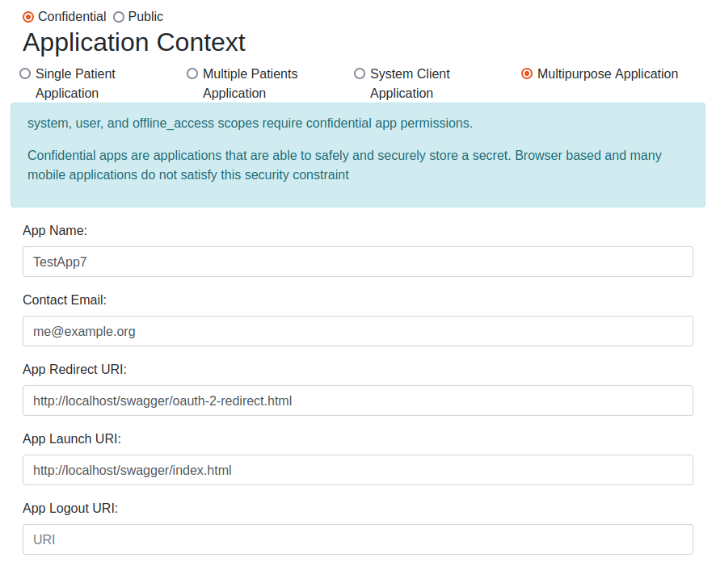
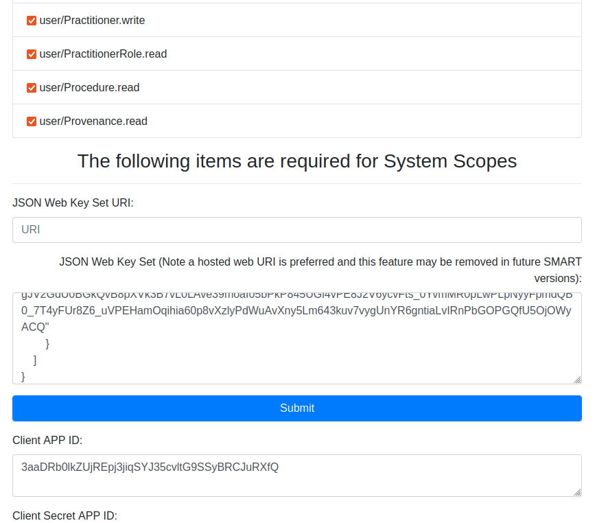
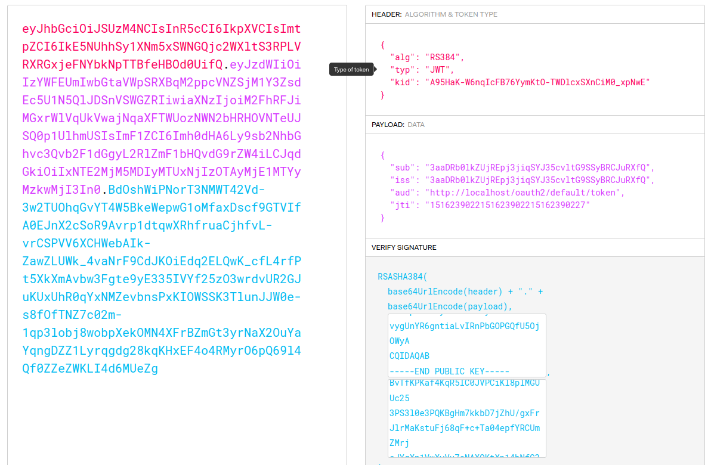

# FHIR API Setup for OpenEMR
OpenEMR systems can have FHIR API. We have to take two main steps to set up the FHIR API: 1) registering a client and 2) getting an authorization token for the registered client. Most of the instructions listed below have been taken from this [post](https://community.open-emr.org/t/use-fhir-in-open-emr-v7/19117).

## Registering a Client
The first step here is to get a "public and private keypair set". To do this we can visit https://mkjwk.org/ and choose these values from dropdown menus and press the "generate" key: Key Size: 2048, Key Use: Signature, Algorithm: RS384:RSA, Key ID: SHA-256, Show X.509 : Yes.

We should also need to put a tick in front of "Enable OpenEMR FHIR System Scopes" by going to "Connectors" tab after clicking on "Config" under the "Admin" menu. This will let the client access system scopes (e.g., `system/Patient.read`).

Now we are ready to register a client by going to "Admin --> System --> API Clients" and clicking on the "Register New App" button on the top. Fill out the blanks as shown in the screenshots below. You can leave all the scopes selected. 

After you paste your "public and private keypair set" in the "JSON Web Key Set URI" field, you can click on the Submit button to see the "Client APP ID" and "Client Secret APP ID" fields being populated. We will use the "Client APP ID" in the next steps. Also, don't forget to enable this newly created client by going to "Admin --> System --> API Clients" and click on the "Edit" button and click "Enable Client" on the top of opened page.

## Getting Access Token
We need a value named "client assertion", which can only be used once, to obtain an access token. To get this value, we can visit https://jwt.io/ and fill out the fields on the right hand side as shown below to get the "client assertion" value on the left. Replace kid value with yours from the "public and private keypair set". Replace the "sub" and "iss" values with your "Client APP ID". Replace "localhost" in "aud" field with your address. Update "jti" each time you want to generate a new "client assertion value". It can be any string of alphanumeric characters. Finally, paste your own private and public keys you had generated in the first step (i.e., on https://mkjwk.org/).

Now, you can run the curl command below to get the access token in the response.

`SCOPE=<url-encoded version of scope names separated by space (e.g., 'openid%20fhirUser%20online_access')>`
  
`CODE=<client assertion value you obtained in the previous step (e.g., 'eyJhbGciOiJSUzM4NCI...')>`
  
`curl -X POST http://<your address>/oauth2/default/token -H "Content-Type: application/x-www-form-urlencoded" -d "client_assertion_type=urn:ietf:params:oauth:client-assertion-type:jwt-bearer&grant_type=client_credentials&scope=$SCOPE&client_assertion=$CODE"`

## Using Access Token
For example, to query patients from the FHIR API you can run the command below from the command line:

`TOKEN=<access token> (e.g., eyJ0eXAiOiJKV1Q...)`
  
`curl -X GET http://<your address>/apis/default/fhir/Patient -H "Authorization: Bearer $TOKEN"`
